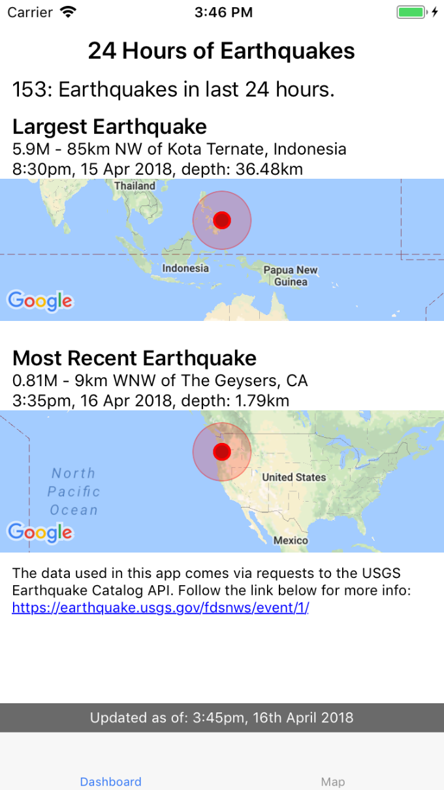
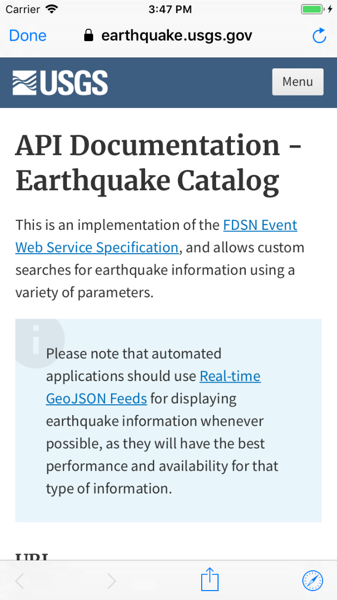
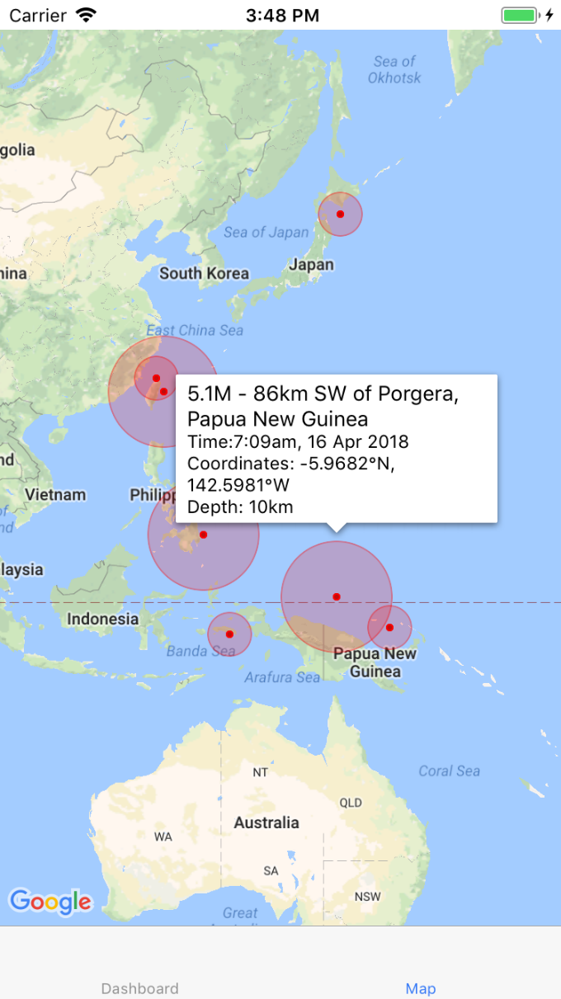

# 24 Hours of Earthquakes App

## A React Native mobile app built using Redux, Axios and Redux Thunk middleware.

To further practice React Native and making api requests, I decided to make an earthquake tracker app, similar to an app I have had on my phone in the past. It fetches the last 24 hours of earthquakes from the US Geological Survey API (https://earthquake.usgs.gov/fdsnws/event/1/) and first displays featured earthquake events on the home page "dashboard" tab (largest earthquake in last 24 hours and the most recent earthquake). The user can also click through to the full screen map tab, where all of the last 24 hours of earthquakes are plotted, with further information for a particular event displayed in a callout when selected. By building this app I gained experience implementing tab based navigation and using the React Native Map plugin and components.

To view the app, visit the following link: https://exp.host/@tatherton/24-hours-of-earthquakes

You will need to have the Expo client installed to view the app. Documentation for the client can be found here: https://expo.io/tools#client

## Screenshots

### Dashboard Tab

When the app first loads, the dashboard tab shows featured earthquake event information from the last 24 hours.

### In App Browser

Clicking the link at the bottom of the dashboard tab opens an in-app browser directed to the US Geological Survey API page.

### Map Tab

The map tab displays all registered earthquake events from the last 24 hours. The radius of the coloration around the earthquake event relates to the earthquake magnitude. Clicking on any individual event displays further information in a callout bubble.
